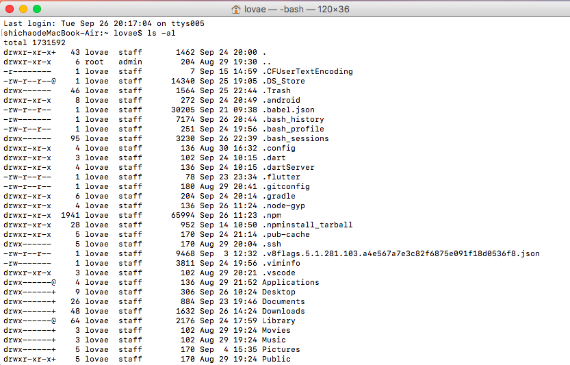

# 文件系统
## 第一节 文件权限概念
### 文件属性 -- ls -al

<image url="./imgs/ls.png"/>



##### 第一列表示 文件类型：

###### 第一个字符
* d 开头表示 文件夹、目录
*  \- 开头表示 文件
* l  => link 文件
* b  =》 可储存的接口设备
* c  =》 串行端口

###### 第一列剩下的 三个为一组，表示权限

> r => read;  w => write;  x => execute;  ‘-’ => 没有权限

* 第一组： 文件所有者权限
* 第二组：  同同用户组权限
* 第三组：  其他非本用户组的权限

##### 第二列 连接到此文件的连接数

##### 第三列 该目录/文件 的所有者
##### 第四列 该目录所属用户组
##### 第五列 文件容量大小： 默认单位为 B
##### 第六列 创建日期或修改日期
日期如果太久远，会只显示年份；
若要显示完整日期格式，添加参数： 
```
ls -l --full-time
```

##### 第七列 文件名
> 若文件名以 “.” 开头，表示隐藏文件


### 修改文件属性域权限

#### chgrp
> change group 修改所属用户组
参数 -R ： 递归调用，连同修改子目录

```
chgrp [R] dirname/filename
```

#### chown
> cahnge owner 修改所有者
```
chown [R] dirname/filename
```

#### chmod

> 改变权限。共有两种方式

##### 以数字方式：

* rwx => 4-2-1 => 7
* r-x => 4-0-1 => 5
* ...
```
chmod [R] xyz dirname/filename 
```
##### 以符号类型：
```
chmod u=rwx, g=rx, o=rx

//也可合并：
//chmod u=rwx, go=rx
```

如果不知道原来的类型，只想在原来基础上添加或减少,用 ‘+、-’

```example
chmod a-x .bashrc
```

### 目录与文件权限的意义
##### 对于文件
> r => read; 

>w => write; 包含编辑、新增、修改文件内容，但不包括删除

>x => excute; 执行该文件

##### 对于目录
> r => 读取目录结构列表， 可以用 `ls`

> w => 新建、删除目录或文件， 重命名， 转移目录内容、位置

> x => 目录不能执行， x 代表用户能否进入该目录成为工作目录（cd 进入该目录）

### Linux 文件种类与扩展名

#### 文件种类

* 普通文件 regular file
* 纯文本文件 ASCLL
* 二进制文件 binary
* 数据格式文件 data
* 目录 directory
* 连接文件 link
* 设备、设备文件 device
* 套接字 socket
* 管道 pipe （FIFO： first in first out）

#### 扩展名
> linux 文件能不能被执行，与他的第一列第十个属性有关，与文件名没有关系
而在 Windows 下，能被执行的文件扩展名通常是 .com/.exe/.bat/...

* 可以被执行 和 能执行成功不一样。因为可以修改 `x` 属性

##### 常用扩展名
* `*.sh` 脚本、批处理文件（scripts）
* `Z`  `*.tar`  `*.tar.gz`  `*.zip`  `*.tgz`  压缩文件
* `.html`  `.php` 网页相关文件

#### 长度限制

> 默认的文件系统，文件名长度限制：
* 单一文件或目录最大文件名为 255 字符
* 完整文件或目录最大为 4096 字符

### 第二节 目录配置

#### Linux 目录配置标准
###### 四个类型
* 可分享的  包括执行文件与用户的邮件等等
* 不可分享的  自己机器上的备份文件或是与程序相关的socket等等
* 不变的  函数库、文件说明库
* 可变的  登录文件、新闻组等

###### 三个目录
* / (root, 根目录) 与开关机有关 
* /usr (Unix software resource)  与软件安装、执行有关
* /var (variable)  与操作系统运作有关

##### 根目录的意义与内容
##### usr
##### var   //先略过

#### 相对路径与绝对路径
> 由 `/` （根目录）开头的路径

> 由 `./` 、`../` 开头的相对路径

#### CentOS 的查看
查看 Linux 内核的命令
```js
uname -r
//查看实际的内核版本
```